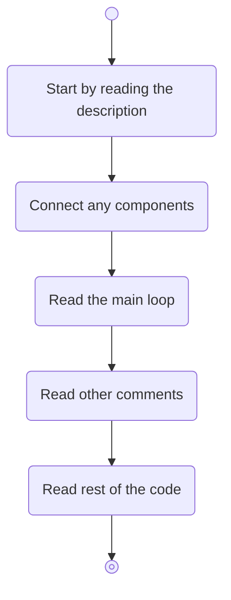

# Guide to Reading Code

{: .mt-6 }

{: .center-flowchart }

```mermaid
graph TD;
    START@{ shape: sm-circ }
    A(Start by reading the description)
    B(Connect any components)
    C(Read the main loop)
    D(Read other comments)
    E(Read rest of the code)
    STOP@{ shape: framed-circle }
    START-->A-->B-->C-->D-->E-->STOP
```